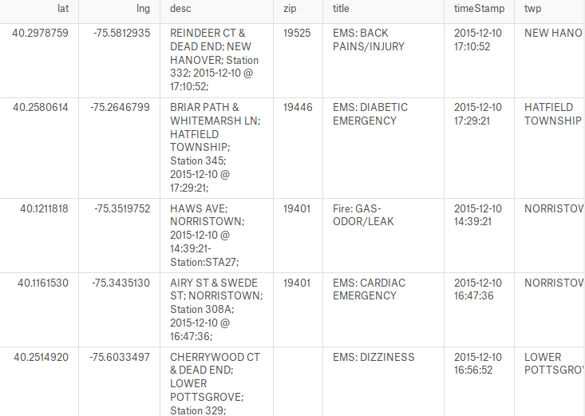

## Source du dataset

Dataset disponible sur Kaggle : https://www.kaggle.com/mchirico/montcoalert

## Aperçu du dataset 

<table border="0">
  <tr>
    <td>
      
    </td>
  </tr>
  <tr>
    <td>
      Aperçu du dataset
    </td>
  </tr>
</table>

Ce jeu de données contient le détail des 266543 appels passés au 911 aux USA entre le 10 décembre 2015 et le 11 mars 2017

Pour chaque appel, nous disposons en particulier de la localisation de l'émetteur, l'heure de l'appel et le motif de l'appel, classé selon 3 grandes catégories :
* Fire
* EMS
* Traffic

Chacune de ses catégories possède une description standardisée.

