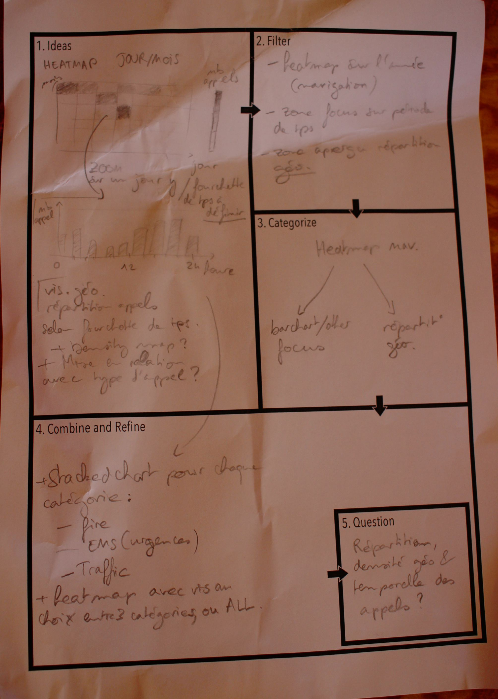
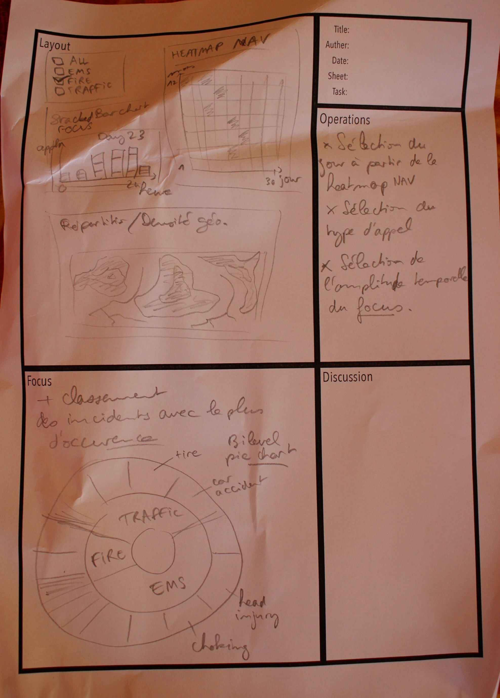
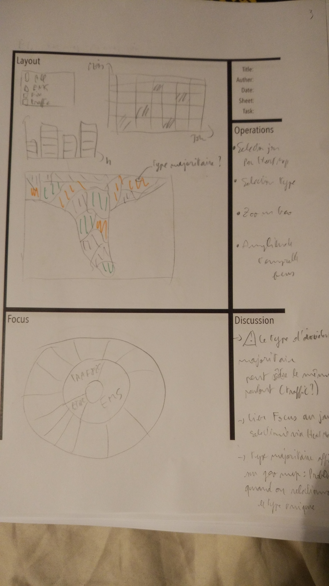
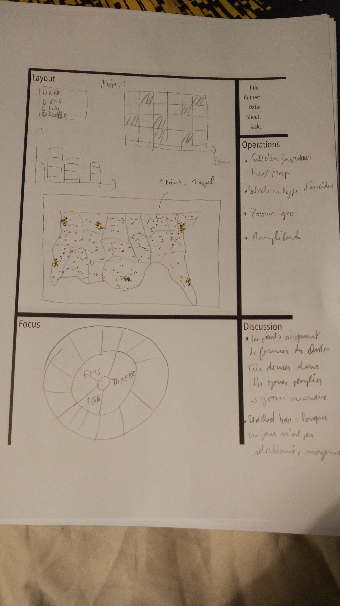
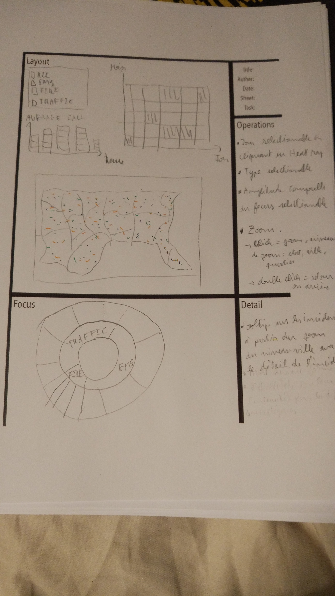

# 911 calls data visualization

## First sheet

La première feuille de design nous permet de proposer une visualisation de la densité des appels sous forme de heat map en fonction du jour et du mois.

Nous pouvons affiner cette vue en proposant un stacked bar chart donnant le détail des types d'urgences par heure, à partir d'un jour sélectionné sur la heat map

Il sera aussi possible de se limiter à un seul type d'incident.

<table border="0">
  <tr>
    <td>
      
    </td>
  </tr>
  <tr>
    <td>
      First design sheet
    </td>
  </tr>
</table>

## Second design sheet

Cette première vue passe à côté d'un aspect important de ce jeu de données: la répartition géographique. Nous intégrerons donc une carte choroplèthe qui donne par état, le type d'incident majoritaire (Fire/EMS/Traffic)

Le focus permettre d'accéder aux sous catégories majoritaires pour chaque type d'incident grâce à un pie chart à deux niveaux.

<table border="0">
  <tr>
    <td>
      
    </td>
  </tr>
  <tr>
    <td>
      Second design sheet
    </td>
  </tr>
</table>

Si cette carte donne un bon aperçu de la répartition temporelle, nous pouvons cependant affiner la représentation géographique de notre jeu de données.

## Third design sheet

Nous ajouterons donc une interaction supplémentaire sur la carte : un zoom, qui permet de visualiser les données au niveau des communes (avec une vue de tout l'état séléctionné par clic sur la carte).

<table border="0">
  <tr>
    <td>
      
    </td>
  </tr>
  <tr>
    <td>
      Third design sheet
    </td>
  </tr>
</table>

Cependant ici apparaissent les limites de la carte choroplèthe :
* Le type d'incident majoritaire peut être le même pour une grande majorité d'états/commune
* Cette carte perds tout intérêt lorsque l'on séléctionne un type d'incident en particulier

## Fourth design sheet

Ainsi nous changerons la représentation géographique des données. Nous représenterons chaque appel par un point, de couleur différente pour chaque type d'incident.

<table border="0">
  <tr>
    <td>
      
    </td>
  </tr>
  <tr>
    <td>
      Fourth design sheet
    </td>
  </tr>
</table>

Au niveau du pays, les incidents de la route metterons en lumière les axes routiers dangereux mais les points formerons probablement des clusters denses dans les zones peuplées. Il faut donc permettre de zoomer.

Il apparait aussi qu'il faut donner un comportement par défaut au stacked bar chart lorsque aucun jour n'est selectionné. La moyenne des appels par heure fera l'affaire.

## Fith design sheet

Nous opterons finalement pour une carte zoomable à plusieurs niveaux :
* Initial : pays
* Etat (premier click)
* Commune(Second click)
* Quartier (Troisième click)
* Double click pour retour en arrière

La carte sera réinitialisée à chaque filtrage effctué sur le jour ou le type.

A partir du niveau de zoom de la commune, les incidents seront associés à un tooltip donnant leur sous catégorie et l'heure à laquelle l'appel à été passé.

Le focus sera lié à la sélection du type, du jour et de la plage géographique visible.

<table border="0">
  <tr>
    <td>
      
    </td>
  </tr>
  <tr>
    <td>
      Fith design sheet
    </td>
  </tr>
</table>

Cette visualisation permettra donc de visualiser finement la répartition géographique, temporelle et catégorielle des incidents.
